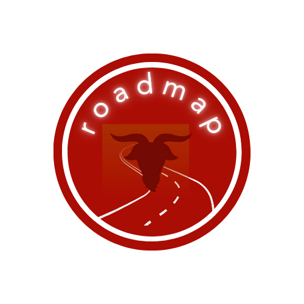

<p align="center">
  <a href="https://github.com/WPI-Roadmap">
    
  </a>
  <h3 align="center">Roadmap-WPI</h3>

  <p align="center">
    A universal solution to introduce you to WPI's major requirement system <br> Developed by WPI students for WPI students (GoatHack 2024).
    <br>
    </p>
</p>

### About

Roadmap-WPI provides a clean, aesthetic visual solution to help incoming WPI students understand the major requirements system. The website is designed to be easy to use and understand, and is a great resource for students to use when planning their academic career by keeping track of their major requirements and progress as well as visualizing prerequisites and course offerings. This project was developed by Randy Huang, Tarun Eswar, Ajay Bhagavatula, Erica Dong, and Charles Tang for the GoatHacks 2024 hackathon at WPI.

### Technical
#### Technology Used
<div align="center">
<p align="center"> <a href="https://expressjs.com" target="_blank" rel="noreferrer">  </a><a href="https://getbootstrap.com" target="_blank" rel="noreferrer">  </a> <a href="https://www.w3schools.com/css/" target="_blank" rel="noreferrer">  </a>  <a href="https://firebase.google.com/" target="_blank" rel="noreferrer">  </a> <a href="https://www.w3.org/html/" target="_blank" rel="noreferrer">  </a>  <a href="https://developer.mozilla.org/en-US/docs/Web/JavaScript" target="_blank" rel="noreferrer">  </a> <a href="https://www.mongodb.com/" target="_blank" rel="noreferrer">  </a> <a href="https://nodejs.org" target="_blank" rel="noreferrer">  </a> <a href="https://reactjs.org/" target="_blank" rel="noreferrer">  </a> </p>

</div>

#### Local Hosting

To run the project locally, you may clone this respository. You must have Node version 18+ installed on your machine.

```bash
git clone https://github.com/WPI-Roadmap/client-side.git
```

Then, install the dependencies.

```bash
cd client-side
npm install
```

Finally, run the project.

```bash
npm start
```

Go to `localhost:3000` to view the project.

### Feature List

- [x] Roadmap visualization for all majors (hierarchal diagram)
- [x] Sync with OSCAR.wpi.edu and COURSELISTINGS.wpi.edu for up-to-date course offerings and professor/course ratings
- [x] Tracking sheet digitization for helping you satisfy major requirements
- [ ] LLM-based course recommendations based on your major, interests, and satisfaction with past courses
- [ ] Profile syncing and WPI SSO

### Contributing

We'd love to have your help in making Roadmap-WPI better. The project still has work to do before full production launch, but if there's an issue you'd like to see addressed sooner rather than later, let us know. 

For any concerns, please open an [issue](https://github.com/WPI-Roadmap/client-side/issues), or feel free to, [fork the project and send a pull request](https://github.com/WPI-Roadmap/client-side/pulls). 

<hr>


### Versions
* Version 1.0 (01/14/2024)
    * Initial Release
    * See [Commits history]

### License


[](#)  


[](https://github.com/tamzi/ReadMe-MasterTemplates/blob/master/LICENSE)
